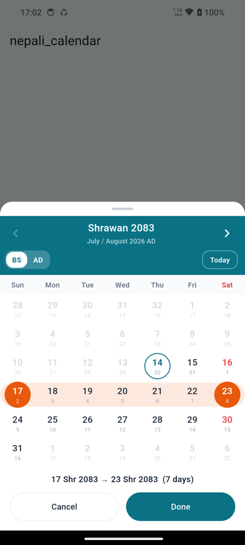

# custom_nepali_calendar

A Nepali (Bikram Sambat) date picker that opens in a **bottom sheet**. The calling
app passes its **theme colours** and whether it wants a **single date or a range**,
and gets the picked value back.

Written from scratch — **no third-party dependencies**, no platform channels, no
native code. Pure Dart and the Flutter SDK, so it runs anywhere Flutter runs.



## Install

```yaml
dependencies:
  custom_nepali_calendar:
    git:
      url: https://github.com/your-org/custom_nepali_calendar.git
  # or, from a local checkout:
  # custom_nepali_calendar:
  #   path: ../custom_nepali_calendar
```

```console
flutter pub get
```

## Use

```dart
import 'package:custom_nepali_calendar/custom_nepali_calendar.dart';

// 1. A single date
final selection = await showNepaliCalendar(
  context: context,
  theme: const NepaliCalendarTheme(
    primaryColor: Color(0xFF0B7285),      // header + active switch segment
    selectedDayColor: Color(0xFFE8590C),
    weekendColor: Color(0xFFE03131),      // Saturday
  ),
);

if (selection != null) {
  final NepaliDate date = selection.date!;
  print(date);                 // 2083-04-14   Bikram Sambat
  print(selection.dateTime);   // 2026-07-30   Gregorian DateTime
}
```

```dart
// 2. A date range — same call, different mode
final selection = await showNepaliCalendar(
  context: context,
  mode: NepaliCalendarMode.range,
  theme: myCalendarTheme,
);

if (selection != null) {
  final NepaliDateRange range = selection.range!;
  print('${range.start} → ${range.end}');   // 2083-04-10 → 2083-04-20
  print(range.lengthInDays);                // 11, both ends counted
  print(selection.dateTimeRange);           // Gregorian DateTimeRange
}
```

`showNepaliCalendar` resolves to **`null`** when the user dismisses the sheet
(Cancel, swipe down, back gesture, tap outside), so a null check is the only error
handling needed. In range mode the first tap sets the start and the second the
end; the days between are banded and the confirm button stays disabled until both
ends exist.

The sheet shows a BS/AD toggle and nothing else — the language is whatever the
caller passed and cannot be changed from inside the sheet. Nothing is
preselected: the user always picks, and the confirm button stays disabled until
they do. Below the grid there are only the two buttons — no date readout — unless
you pass a `title`.

### Limiting the calendar: `allowedRange` and `maxDays`

Two ways to say the same thing — the window the calendar offers. Both are
optional, and both apply in either calendar system and either mode.

```dart
// A window: only these days are selectable, and the month arrows stop at the
// window's first and last month.
await showNepaliCalendar(
  context: context,
  allowedRange: NepaliDateRange(
    start: NepaliDate.now(),
    end: NepaliDate.now().addDays(365),
  ),
);

// The same window as a day count: today and the next 89 days.
await showNepaliCalendar(context: context, maxDays: 90);

// Both: the count is measured from the window's first day, tighter end wins.
await showNepaliCalendar(
  context: context,
  mode: NepaliCalendarMode.range,
  allowedRange: NepaliDateRange(
    start: const NepaliDate(2083, 1, 1),
    end: const NepaliDate(2083, 12, 30),
  ),
  maxDays: 90,          // → 1 Baishakh 2083 … 89 days later
);

// Neither passed: the whole supported range, BS 1970–2199.
await showNepaliCalendar(context: context);
```

* `maxDays` counts from `allowedRange`'s first day, or from **today** when no
  range is given, and includes that first day — so `maxDays: 90` alone means
  today plus the next 89.
* Days outside the resulting window render greyed out and are not tappable, and
  the month arrows stop at the window's first and last month. A picked range
  therefore can never be longer than the window.
* Both apply to single and range mode, and in both Bikram Sambat and Gregorian
  view — the window is a set of days, not of month labels.
* The sheet opens on the window's first month; with no window it opens on the
  current month.
* Holding Gregorian dates? `NepaliDateRange.fromDateTimes(start: ..., end: ...)`.

### All parameters

```dart
await showNepaliCalendar(
  context: context,

  mode: NepaliCalendarMode.single,          // or .range
  theme: const NepaliCalendarTheme(...),    // your colours — see below

  allowedRange: NepaliDateRange(            // optional window — see below
    start: NepaliDate.now(),
    end: const NepaliDate(2084, 12, 30),
  ),
  maxDays: 90,                              // …or give the window as a length

  language: Language.english,               // or Language.nepali (fixed by you)
  initialSystem: CalendarSystem.bs,         // or CalendarSystem.ad

  showSystemSwitch: true,                   // the BS/AD toggle in the header
  isDismissible: true,                      // false to force Cancel/Done

  title: 'Delivery date',                   // optional caption above the buttons
  confirmLabel: 'Apply',
  cancelLabel: 'Back',
  maxWidth: 480,                            // caps the sheet on tablets
);
```

## Theming

Every colour comes from `NepaliCalendarTheme`, and every field has a usable
default — pass only what you want to change:

```dart
const NepaliCalendarTheme(
  primaryColor: Color(0xFFC1272D),      // header background, active switch
  selectedDayColor: Color(0xFF003893),  // selected day, range ends
  selectedDayTextColor: Colors.white,
  rangeFillColor: Color(0x22003893),    // band between range ends
  todayHighlightColor: Color(0xFF2F9E44),
  weekendColor: Color(0xFFC1272D),      // Saturday, the Nepali weekend
  textColor: Color(0xFF1D2939),
  subtitleTextColor: Color(0xFF98A2B3),
  headerTextColor: Colors.white,
  backgroundColor: Colors.white,
  disabledDayColor: Color(0xFFD0D5DD),
  weekdayHeaderColor: Color(0xFF667085),
  weekdayHeaderBackgroundColor: Color(0xFFF9FAFB),
  dividerColor: Color(0xFFEAECF0),

  fontFamily: 'Mukta',                  // optional; system fonts cover Devanagari
  dayCellShape: BoxShape.circle,        // or BoxShape.rectangle
  borderRadius: 12,
  cellSpacing: 2,
)
```

Shortcuts: `NepaliCalendarTheme.dark()`, `NepaliCalendarTheme.fromTheme(Theme.of(context))`
to follow the host app's `ColorScheme`, and `copyWith` on any instance.

Android and iOS both ship a Devanagari-capable system font, so Nepali text renders
with no configuration; set `fontFamily` (plus `fontPackage` if it lives in another
package) only when you want your own font.

## What you get back

```dart
class NepaliCalendarSelection {
  NepaliDate? date;            // set in single mode
  NepaliDateRange? range;      // set in range mode
  DateTime? dateTime;          // date as Gregorian
  DateTimeRange? dateTimeRange;// range as Gregorian
  NepaliCalendarMode mode;
}
```

`NepaliDate` is an immutable BS year/month/day:

```dart
const date = NepaliDate(2081, 1, 15);
date.toDateTime();            // Gregorian equivalent
date.isValid;                 // false for e.g. NepaliDate(2081, 2, 33)
date.weekdayIndex;            // 0 = Sunday … 6 = Saturday
date.isSaturday;              // the Nepali weekend
date.daysInMonth;             // 31
date.addDays(45); date.differenceInDays(other);
date < other;                 // full comparison operators
date.format('EEEE, d MMMM yyyy');                        // Wednesday, 15 Baishakh 2081
date.format('d MMMM yyyy', language: Language.nepali);    // १५ बैशाख २०८१
NepaliDate.now(); NepaliDate.fromDateTime(DateTime.now());
```

`NepaliDateRange` is an inclusive pair: `start`, `end`, `lengthInDays`,
`isSingleDay`, `contains(date)`, `days`, `normalized`, `toDateTimeRange()`.

Conversion is also available without any UI — `DateConverter.adToBs(dateTime)` and
`DateConverter.bsToAd(nepaliDate)` — and out-of-range or impossible dates throw a
descriptive `DateConversionException`.

## Supported range and accuracy

**BS 1970–2199**, i.e. **AD 1913-04-13 to 2143-04-15**. BS month lengths are not
formula-derived, so they come from a hard-coded table anchored at
`1 Baishakh 1970 BS = 13 April 1913 AD`; Gregorian maths (leap years, weekdays,
day arithmetic) is computed from Julian Day Numbers rather than `DateTime`.

The table is verified against 15 independently known real-world dates (Nepali New
Year of 2000, 2050, 2070 and every year 2072–2083 BS), plus every day in the range
round-tripping BS → AD → BS losslessly and every BS weekday matching the Gregorian
weekday of the same day.

To widen the range, add real published month lengths to
`lib/src/data/bs_calendar_data.dart`; every bound follows from that table.

## Layout

```
lib/
  custom_nepali_calendar.dart              # the public API — nothing else is exported
  src/
    sheet/nepali_calendar_sheet.dart  # showNepaliCalendar + selection/mode types
    models/nepali_date.dart
    models/nepali_date_range.dart
    theme/nepali_calendar_theme.dart
    converters/                       # BS ⇄ AD, Gregorian maths, exception
    data/bs_calendar_data.dart        # BS year -> [days per month]
    localization/calendar_strings.dart
    view/                             # internal: the month grid the sheet shows
example/                              # one screen, two buttons
test/
```

## Run it / test it

```console
cd example && flutter run     # Android emulator, iOS simulator or a real device
flutter test                  # the package
```

## License

MIT — see [LICENSE](LICENSE).
